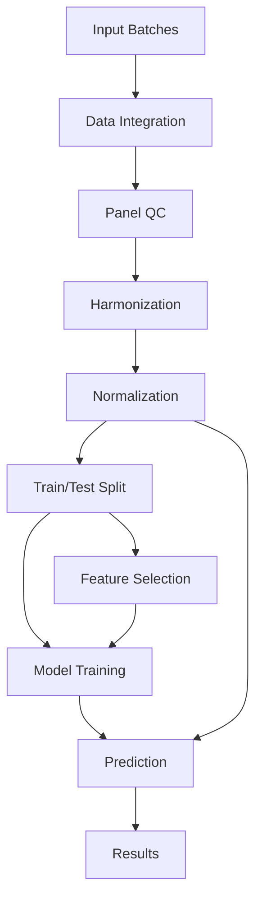

# ClassyFlow

**Automated Cell Type Classification Pipeline for Multiplex Imaging Data**

[](https://www.nextflow.io/)
[](https://www.python.org/)
[](LICENSE)

## Overview

ClassyFlow is a comprehensive, automated pipeline for cell type classification from multiplex imaging data.

## Pipeline Architecture



## Quick Start

### Requirements

- [Nextflow](https://www.nextflow.io/) ≥ 23.04.0
- [Python](https://www.python.org/) ≥ 3.10
    - fpdf 1.7.2
    - numpy 1.23.5
    - matplotlib 3.8.0
    - dataframe-image 0.2.3
    - pandas 2.2.0
    - seaborn 0.13.1
    - xgboost 1.6.2
    - scipy 1.12.0
    - scikit-learn 1.4.0
- [Docker](https://www.docker.com/)
- [Conda](https://docs.conda.io/) (recommended)


### Installation

#### Clone repository to your working directory
```bash
# Clone the repository
git clone https://github.com/yourusername/ClassyFlow.git
cd ClassyFlow
```

#### Install Python dependencies
##### Option 1: Installing locally
```bash
# Create Conda environment (optinal but recommended)
conda create -n classyflow python=3.10

# Install python packages
pip install -r requirements.txt
```

##### Option 2: Docker Alternative
```bash
# <<<Add docker related instructions here>>>

# Run pipeline in container
nextflow run main.nf -profile docker
```

### Basic Usage

```bash
# Run pipeline with example data
nextflow run main.nf -c nextflow_ovtma.config
```

## Input Data Format

ClassyFlow expects measurement tables (quantification files) generated using QuPath 0.5+ from segmented single cell MxIF images. The pipeline supports multiple batches as input, organized as follows:

```
input_directory/
├── batch1/
│   ├── sample1_QUANT.tsv
│   ├── sample2_QUANT.tsv
│   └── ...
└── batch2/
    ├── sample1_QUANT.tsv
    ├── sample2_QUANT.tsv
    └── ...
```

The quantification files need to include some annotated classification labels to train the models. A minimum of 30-50 annotations per phenotype is recommended. 

### Required Columns

- `Classification`: Cell type annotation
- `Centroid X µm`: X coordinate of the cell's centroid
- `Centroid Y µm`: Y coordinate of the cell's centroid
- Marker intensities (e.g., `CD3: Cell: Mean`, `CD4: Cell: Mean`)

## Configuration

### Core Pipeline Settings
| Parameter | Default | Description |
|-----------|---------|-------------|
| `help` | `false` | Display help message and exit |
| `input_dirs` | `"./input"` | Path to input directory |
| `output_dir` | `"classyflow_output"` | Output directory for all results |

### Input Data Configuration
| Parameter | Default | Description |
|-----------|---------|-------------|
| `slide_contains_prefix` | `"True"` | Image names contain "_" delimited slide prefix |
| `folder_is_slide` | `"False"` | Folder represents single slide with multiple ROIs |
| `quant_file_extension` | `".tsv"` | File extension for quantification files |
| `quant_file_delimiter` | `"\\t"` | Column delimiter (tab or comma) |
| `bit_depth` | `"16-bit"` | Original Image Capture quality: 8-bit (pixel values will be 0-255) or 16-bit (pixel values will be 0-65,535) |
| `qupath_object_type` | `'DetectionObject'` | "CellObject" has two ROIs, jointly and 4 components [Cell, Cytoplasm, Membrane, Nucleus] from QuPath; 'DetectionObject' is Single Whole Cell or Nucleus only |

### Marker and Feature Settings
| Parameter | Default | Description |
|-----------|---------|-------------|
| `nucleus_marker` | `"DAPI"` | Nuclear marker for normalization reference |
| `housekeeping_marker` | `"S6"` | Housekeeping gene marker |
| `classifed_column_name` | `"Classification"` | Column name containing cell type annotations |
| `exclude_markers` | `"Arg1\|BAD\|B2M\|..."` | Pipe-delimited markers to exclude from analysis. Keep in mind that this is matched using regex, so if CD3 is included in this list, the algorithm will also exclude any markers with "CD3" (e.g. CD31, CD33, etc..) |
| `plot_fraction` | `0.25` | Fraction of data that will be used for the quality control plots |

### Normalization Parameters
| Parameter | Default | Description |
|-----------|---------|-------------|
| `override_normalization` | `"boxcox"` | Normalization method that will be used for downstream analyses |
| `downsample_normalization_plots` | `0.5` | Fraction of data that will be used for normalization plots |
| `quantile_split` | `1024` | Number of quantiles for QuantileTransformer. This is good for 16-bit, but not for 255-bit or Dualband/Hyperion |

### Data Splitting and Training
| Parameter | Default | Description |
|-----------|---------|-------------|
| `holdout_fraction` | `0.1` | Fraction of data reserved for final validation |
| `filter_out_junk_celltype_labels` | `"??,?,0,Negative,Ignore*"` | Cell types to exclude from training |
| `minimum_label_count` | `20` | Minimum cells required per cell type to be included in the training set |

### Feature Selection
| Parameter | Default | Description |
|-----------|---------|-------------|
| `min_rfe_nfeatures` | `2` | Minimum features for RFE evaluation |
| `max_rfe_nfeatures` | `3` | Maximum features for RFE evaluation |

### XGBoost Model Parameters
| Parameter | Default | Description |
|-----------|---------|-------------|
| `max_xgb_cv` | `10` | Maximum cross-validation iterations |
| `xgb_depth_start` | `2` | Minimum tree depth for grid search |
| `xgb_depth_stop` | `6` | Maximum tree depth for grid search |
| `xgb_depth_step` | `3` | Step size for tree depth search |
| `xgb_learn_rates` | `"0.1"` | Comma-separated learning rates to test |

### Prediction Settings
| Parameter | Default | Description |
|-----------|---------|-------------|
| `predict_class_column` | `'CellType'` | Column name for predictions |
| `predict_le_encoder_file` | `"${params.output_dir}/models/classes.npy"` | Path to label encoder |
| `predict_columns_to_export` | `'Centroid X µm,Centroid Y µm,Image,CellTypePrediction'` | Columns to include in the output files |
| `predict_cpu_jobs` | `16` | CPU cores to use for cell type prediction |

### Optional Features
| Parameter | Default | Description |
|-----------|---------|-------------|
| `run_get_leiden_clusters` | `false` | Enable clustering-based (scimap) feature augmentation |
| `scimap_resolution` | `0.5` | Resolution parameter for Leiden clustering |

### Execution Profiles

- **local**: Single machine execution (default)
- **slurm**: SLURM cluster execution  
- **gcp**: Google Cloud Platform

### Advanced Usage
```bash
# Run with SLURM cluster
nextflow run main.nf -c nextflow.config -profile slurm

# Run on GCP
nextflow run main.nf -c nextflow.config -profile gcp
```

## Output Structure

```
output/
├── normalization_reports/      # Data normalization comparison reports
├── celltype_reports/           # Feature analysis & training summaries
├── model_reports/              # Training & validation performance report
├── models/                     # Trained classifiers
├── celltypes/                  # Final cell type predictions
├── clusters/                   # Optional clustering analysis using scimap
```

## Workflow Details

### Data Processing Pipeline

1. **Data Integration**: Merges quantification files from multiple batches
2. **Panel Design Check**: Analyzes marker presence across datasets
3. **Feature Harmonization**: Adds synthetic noise for missing markers
4. **Normalization Testing**: Evaluates Box-Cox, quantile, min-max, and log transformations
5. **Data Splitting**: Creates stratified train/holdout sets

### Feature Selection Strategy

1. **Binary Classification Setup**: One-vs-rest approach per cell type
2. **LASSO Regularization**: L1 penalty optimization via grid search
3. **Recursive Feature Elimination**: Cross-validated feature ranking
4. **Performance Evaluation**: Cell type-specific feature importance analysis
5. **Feature Integration**: Combines results across all cell types

### Model Development

1. **Parameter Space Definition**: Systematic grid search configuration
2. **Hyperparameter Tuning**: Cross-validated XGBoost optimization
3. **Model Training**: Multiple models with early stopping
4. **Holdout Validation**: Performance testing on reserved data
5. **Model Selection**: Best performer based on validation metrics

### Getting Help

- [Issue Tracker](https://github.com/yourusername/ClassyFlow/issues)
- Email: [your.email@mayo.edu](mailto:your.email@institution.edu)

## Citation

If you use ClassyFlow in your research, please cite:

```bibtex
@software{ClassyFlow2024,
  title={ClassyFlow: Automated Cell Type Classification Pipeline for Multiplex Imaging},
  author={Raymond Moore},
  year={2024},
  url={https://github.com/yourusername/ClassyFlow},
  version={1.0.0}
}
```

## License

This project is licensed under the MIT License - see the [LICENSE](LICENSE) file for details.

---

## Links

- [Homepage](https://github.com/dimi-lab/ClassyFlow)
- [QuPath](https://qupath.github.io/)

