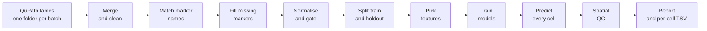

<p align="center">
  
</p>

<p align="center">
  <a href="LICENSE"></a>
  =23.04">
  
</p>

# ClassyFlow

ClassyFlow assigns a cell type to every cell in a multiplex imaging experiment.

You give it the per-cell measurement tables that QuPath exports, in which some
cells have already been labelled by hand. ClassyFlow learns from those labelled
cells, predicts a type for all the rest, and writes an HTML report showing how
well the classifier did. It runs on a laptop, a cluster, or Google Cloud without
changing anything but the profile name.

---

## Contents

- [How it works](#how-it-works)
- [Requirements](#requirements)
- [Quick start](#quick-start)
- [Preparing your data](#preparing-your-data)
- [Marker names and cell types](#marker-names-and-cell-types)
- [Running the pipeline](#running-the-pipeline)
- [Outputs](#outputs)
- [Tests](#tests)
- [Citation, license and support](#citation-license-and-support)

---

## How it works


```mermaid
flowchart LR
  A["QuPath tables<br/>one folder per batch"] --> B["Merge<br/>and clean"]
  B --> C["Match marker<br/>names"]
  C --> D["Fill missing<br/>markers"]
  D --> E["Normalise<br/>and gate"]
  E --> F["Split train<br/>and holdout"]
  F --> G["Pick<br/>features"]
  G --> H["Train<br/>models"]
  H --> I["Predict<br/>every cell"]
  I --> J["Spatial<br/>QC"]
  J --> K["Report<br/>and per-cell TSV"]
```

| Step | What happens |
| --- | --- |
| Merge and clean | All tables in a batch folder are combined into one table. Markers you listed in `exclude_markers` are dropped. |
| Match marker names | Optional. Raw channel names such as `DAPI_AF_R01` are renamed to a single canonical name so batches line up. |
| Fill missing markers | Batches stained with different panels are compared. Markers a batch does not have are filled with low-level noise so every batch has the same columns. |
| Normalise and gate | Marker values are put on a common scale, then a two-component mixture model marks each marker positive or negative per cell. |
| Split train and holdout | Labelled cells are split by batch and cell type. A slice is set aside and never used for training, so the final numbers are honest. |
| Pick features | For each cell type, a LASSO sweep followed by recursive feature elimination finds the small set of measurements that separates it best. |
| Train models | A grid of XGBoost settings is searched with cross-validation. The best two are trained in full and scored on the holdout; the winner is kept. |
| Predict every cell | The winning model labels every cell in every batch, including unlabelled ones, with the top two class probabilities. |
| Spatial QC | Predictions are binned by position and sparse, isolated calls are flagged. |
| Report | An HTML report covers input counts, normalisation, features, model performance and final cell counts. |

Every step above is several Nextflow processes. For the full process graph, see
[docs/detailed_workflow_diagram.mermaid](docs/detailed_workflow_diagram.mermaid)
— paste it into any Mermaid viewer, such as [mermaid.live](https://mermaid.live).

## Requirements

- [Nextflow](https://www.nextflow.io/) 23.04 or newer
- Java 17 or newer (Nextflow needs it; the container ships Java 21)
- Either **Docker**, or **Python 3.10 / 3.11** with the packages in `requirements.txt`

> **Python 3.12 does not work.** One of the dependencies does not build on 3.12.
> Use 3.10 or 3.11, or use the container and avoid the question entirely.

Full instructions for all four ways of running it are in
**[docs/installation.md](docs/installation.md)**.

## Quick start

The repository ships with a small example dataset, so you can check your
installation before touching your own data.

```bash
git clone https://github.com/dimi-lab/ClassyFlow.git
cd ClassyFlow

# install the Python packages first - see docs/installation.md
nextflow run main.nf -profile local

# or, with the container built, skip the Python setup entirely
nextflow run main.nf -profile docker
```

When it finishes, open the report:

```
classyflow_output/final_reports/classyflow_report.html
```

To see every option without running anything:

```bash
nextflow run main.nf --help
```

## Preparing your data

### Folder layout

Put **one folder per batch**, and inside each folder **one file per image or
ROI**. The folder name becomes the batch name in all reports.

```
my_project/
├── batch_A/
│   ├── slide1.ome.tif_QUANT.tsv
│   └── slide2.ome.tif_QUANT.tsv
└── batch_B/
    ├── slide3.ome.tif_QUANT.tsv
    └── slide4.ome.tif_QUANT.tsv
```

Then point the pipeline at those folders:

```bash
nextflow run main.nf -profile local \
  --input_dirs '["/path/my_project/batch_A", "/path/my_project/batch_B"]'
```

### Exporting from QuPath

Use QuPath's **Measure → Export measurements** to write one tab-delimited file
per image. See `assets/images/qupath_example_exporting.PNG` for the dialog.

### File format

Tab-delimited by default, one row per cell. These columns must be present:

| Column | Why it is needed |
| --- | --- |
| `Image` | Identifies the image. The run stops with an error if it is missing. |
| `Classification` | The hand-assigned cell type. Cells with a label train the model; cells without one get predicted. |
| `Centroid X µm`, `Centroid Y µm` | Cell position, used for spatial QC and written to the results. |
| `Object ID` | Cell identifier carried through to the output. |

Marker measurements are named `<Marker>: <Statistic>`, where the statistic is
one of `Mean`, `Median`, `Min`, `Max`, `Std.Dev.` or `Variance`. Note the exact
spelling `Std.Dev.` — that is what QuPath writes.

A real header, shortened:

```
Image	Object ID	Object type	Name	Classification	Parent	ROI	Centroid X µm	Centroid Y µm	DAPI: Mean	DAPI: Median	DAPI: Min	DAPI: Max	DAPI: Std.Dev.	DAPI: Variance	CD4: Mean	...
```

If you exported **cell objects** rather than detections, each marker has four
compartments and the names look like `CD4: Nucleus: Mean`. Set
`qupath_object_type = "CellObject"` in that case.

### Telling ClassyFlow what a folder means

Two settings describe your layout. Set exactly one to `"True"`:

| Setting | Use it when |
| --- | --- |
| `folder_is_slide = "True"` (default) | The folder holds several regions of **one** slide. |
| `slide_contains_prefix = "True"` | The folder holds **several** slides, and the slide name is the part of the image name before the first `_`. |

> These two are text, not true/false. They are compared against the string
> `"True"`, so `--folder_is_slide true` is silently ignored. Write
> `--folder_is_slide "True"`.

### Batches with different panels

This is fine and expected. The example data has two batches with different
numbers of markers. ClassyFlow compares the panels, reports the differences,
and fills the gaps so all batches share one set of columns.

## Marker names and cell types

Two YAML files under `assets/` shape the run. **Both ship as examples built
around the authors' own melanoma panel. Replace them with your own.**

### `assets/markers.yaml` — one name per marker

If the same marker is spelled differently in different batches, list the
canonical name and its aliases here so they merge into one column. `drop` lists
columns to remove outright.

```yaml
markers:
  CD3:
    aliases: [CD3e]
  DAPI:
    aliases: [DAPI_AF_R01]
  CD4:          # already canonical, listed so it resolves cleanly
drop:
  - Histology
```

Matching is exact — there is no guessing. A marker that is neither a canonical
name nor a listed alias is reported rather than silently kept, so a typo in a
channel name cannot slip through as a mystery feature.

This step only runs when you set `batch_correct_column_names = true`.

### `assets/celltype_profile.yaml` — what you expect to see (optional)

Describe the markers each cell type should be positive or negative for.
ClassyFlow then checks the features it chose against your expectations and
reports the agreement in the final report. It does not change the model.

```yaml
cell_types:
  - name: T cell
    markers: { CD3: positive }
  - name: Helper T
    parent: T cell
    markers: { CD3: positive, CD4: positive, CD8: negative }
```

Turn it on with `--celltype_profile assets/celltype_profile.yaml`. Leave it
unset to skip the check.

## Running the pipeline

### Choose where it runs

```bash
nextflow run main.nf -profile local     # this machine, using local Python
nextflow run main.nf -profile docker    # this machine, inside the container
nextflow run main.nf -profile slurm     # a SLURM cluster
nextflow run main.nf -profile gcp       # Google Batch
```

Each profile only changes where work is submitted and how much CPU and memory
it asks for. The science is identical. See
[docs/installation.md](docs/installation.md) for the setup each one needs.

### Change settings

Override anything on the command line:

```bash
nextflow run main.nf -profile local \
  --output_dir my_results \
  --override_normalization quantile \
  --holdout_fraction 0.2
```

Or edit `nextflow.config` if you want the change to stick. Every setting, with
its default and what it does, is listed in
**[docs/parameters.md](docs/parameters.md)**.

### Restart without redoing finished work

```bash
nextflow run main.nf -profile local -resume
```

## Outputs

Everything lands under `output_dir` (`classyflow_output` by default).

```
classyflow_output/
├── celltypes/          <sample>_qPRED.tsv   <- the main result, one row per cell
├── final_reports/
│   ├── classyflow_report.html               full report
│   ├── classyflow_report_light.html         short summary
│   ├── feature_concordance.csv / .json      only with a cell-type profile
│   ├── pages/                               per-slide and per-batch pages, config snapshot
│   └── plots/                               feature, model and holdout figures
├── models/             trained model .pkl, classes.npy, holdout scores
└── annotation/         celltypes.csv, cell_count_table.csv, per_batch_label_count.csv
```

**Start with `classyflow_report.html`.** It walks through the run in order:
what came in, how it was normalised, which features were chosen, how the model
scored on held-out cells, and what was found.

**`celltypes/<sample>_qPRED.tsv`** is what you take to the next analysis. One
row per cell, with position, image, the predicted cell type, the top two class
probabilities and the spatial QC flag. Change which columns appear with
`predict_columns_to_export`.

`report_mode` controls which reports get built: `both` (default), `full`, or
`light`. The light report is a one-page summary for sharing.

## Tests

```bash
./tests/run_tests.sh          # fast unit tests
./tests/run_tests.sh e2e      # full pipeline on a tiny dataset (needs Nextflow)
./tests/run_tests.sh all      # everything
```

See [tests/README.md](tests/README.md) for details.

## Citation, license and support

<!-- TODO: replace with the published manuscript and DOI once available. -->
**Citation:** a manuscript describing ClassyFlow is in preparation. Please check
back here, or open an issue, for the citation.

**License:** MIT — see [LICENSE](LICENSE). Copyright (c) 2024 DIMI Lab.

**Questions and bugs:** https://github.com/dimi-lab/ClassyFlow/issues
